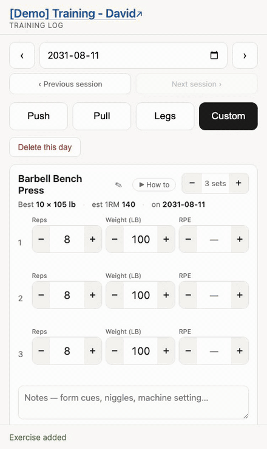
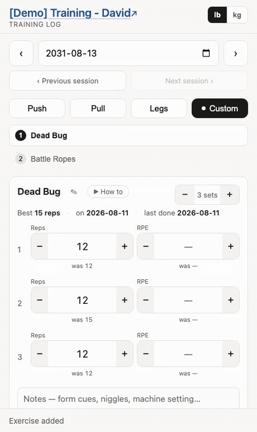
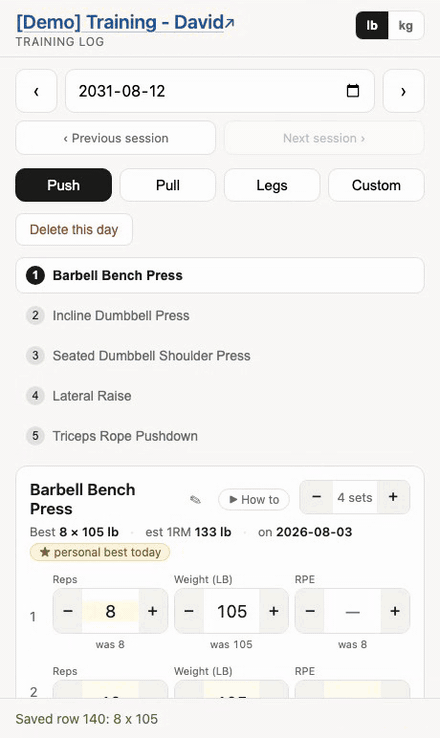
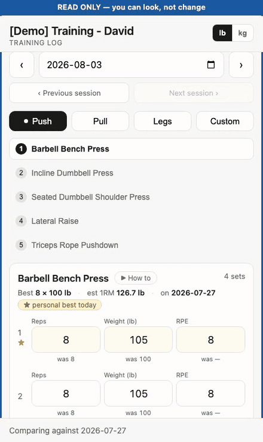

# Training Tracker

A workout log that runs on Google Apps Script over a Google Sheet — free, no
server, and the sheet stays the source of truth.

Open it on a tablet at the rack and tap numbers up and down. Each set carries
an RPE, and next week's session is generated from it: same exercises, slightly
more work, offered as a proposal to override at will.

Every log has an **admin link** (edits) and a **viewer link** (read-only,
enforced server-side). Hold the admin link yourself, or hand it to a personal
trainer who records your sessions.

**[Open the live demo →](https://script.google.com/macros/s/AKfycbxdLep_VYq7ZnH6yGTcM_UzKGZWp7t5jYmtz84GnSGAWTpuydB7OsHtC6-rtqqHaFhIYQ/exec)**  ·  **[The sheet behind it →](https://docs.google.com/spreadsheets/d/1_xVY-Ha2tO6oNJ_I-BWMPHeAT4BM2ww-aGzm7jnab1Y/edit?usp=sharing)**  ·  **[Set it up →](https://david-chau.github.io/training-tracker/setup.html)**  ·  **[Documentation →](https://david-chau.github.io/training-tracker/)**

## What it looks like

| | |
|:---:|:---:|
|  |  |
| **A session, end to end** — pick a day, and it arrives filled in from last week and nudged up. [More →](https://david-chau.github.io/training-tracker/admin.html#running-a-session) | **Log without typing** — every number is a − / + button, read back out of the sheet before it counts. [More →](https://david-chau.github.io/training-tracker/admin.html#3-train-and-adjust) |
|  |  |
| **Supersets** — pair two exercises and they become one card, laid out round by round. [More →](https://david-chau.github.io/training-tracker/admin.html#supersets) | **Personal bests** — worked out from the log and starred on the card as you train. [More →](https://david-chau.github.io/training-tracker/records.html) |
|  |  |
| **A report on demand** — any period, volume and sessions over time, each exercise against its all-time range. Prints to a PDF. [More →](https://david-chau.github.io/training-tracker/admin.html#a-report-you-can-send) | **A read-only link** — the same log with nothing to press, enforced on the server rather than by hiding buttons. [More →](https://david-chau.github.io/training-tracker/viewer.html) |

## Working on the code

- **[Architecture →](https://david-chau.github.io/training-tracker/architecture.html)**
  — how it is put together and why: the sheet as the database, the write queue
  that survives gym wifi, the report, archiving, and how read-only is enforced.
- **[DEVELOPMENT.md](DEVELOPMENT.md)** — the local loop: building the template,
  the tests, the end-to-end suite, and
  [regenerating this demo](DEVELOPMENT.md#the-demo-data).
