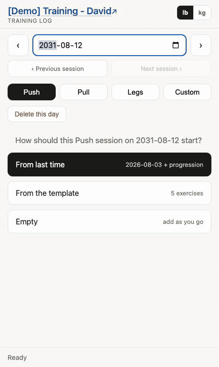
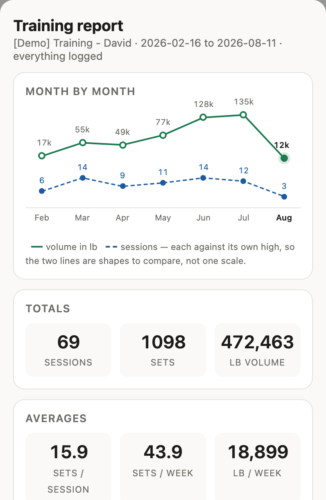

# Training tracker

A workout log that runs on Google Apps Script over a Google Sheet — free, no
server, and the sheet stays the source of truth.

Open it on a tablet at the rack and tap numbers up and down. Each set carries
an RPE, and next week's session is generated from it: same exercises, slightly
more work, offered as a proposal to override at will.

Every log has an **admin link** (edits) and a **viewer link** (read-only,
enforced server-side). Hold the admin link yourself, or hand it to a personal
trainer who records your sessions.

**[Documentation home →](https://david-chau.github.io/training-tracker/)**

One exercise on screen at a time, last week's numbers under each field, and
every tap read back out of the spreadsheet before it counts as saved.

Ask it for a report over any period and it draws one — volume and sessions
week by week, or month by month once you ask for more than half a year, with
each exercise's range for the period against your all-time range. **Save as
PDF** prints what you are looking at.

## Documentation

- [Setup guide](https://david-chau.github.io/training-tracker/setup.html) — import
  the template, paste in the code, publish, share the links
- [Admin guide](https://david-chau.github.io/training-tracker/admin.html)
- [Viewer guide](https://david-chau.github.io/training-tracker/viewer.html)
- [Personal records](https://david-chau.github.io/training-tracker/records.html)
- [Training terminology](https://david-chau.github.io/training-tracker/terminology.html)
- [Architecture](https://david-chau.github.io/training-tracker/architecture.html)
- [Troubleshooting](https://david-chau.github.io/training-tracker/troubleshooting.html)

## Try the read-only demo

- [Open the demo viewer](https://script.google.com/macros/s/AKfycbxH2TaEs7AR-EeINAF9mTYqQ9Dc5-Cy1hST8BP4mw4arttqKQwOKpRMhq5yX7QMyu4BEQ/exec)
- [View the demo spreadsheet](https://docs.google.com/spreadsheets/d/1fjs3pzBXt2AzUgrJWjDrNwbWoD0WaNhlwGPTqTbHaS8/edit?usp=sharing)

Both are read-only. The log holds about six months of seeded training — some
1,100 sets over 70 sessions — chosen to show the things worth seeing:

| Day type | Sessions | What it demonstrates |
|---|---|---|
| **Push** | ~24, weekly | Months of the same lifts, so weights climb and the `was 95` line under each field has something to say. The newest sessions carry RPE and a note. |
| **Pull** | ~23, weekly | Includes `Pull-Up` — no weight field at all |
| **Legs** | ~20, weekly | The heaviest numbers, so records read clearly |
| **Custom** | one, in August | `Plank` in seconds, `Push-Up` unweighted, `Farmer Carry` both timed *and* loaded |

Use **‹ Previous session** to walk back through them — landing on today shows
nothing, because nothing is logged today. Anything older than six months is
[archived off](https://david-chau.github.io/training-tracker/admin.html#history-costs-speed),
which is what keeps the demo quick.

{: .note }
It is a live spreadsheet, not a fixture, so exact numbers may drift. Regenerate
it with `node e2e/seed-demo.js` — see
[DEVELOPMENT.md](DEVELOPMENT.md#the-demo-data).

Working on the code: [DEVELOPMENT.md](DEVELOPMENT.md).
